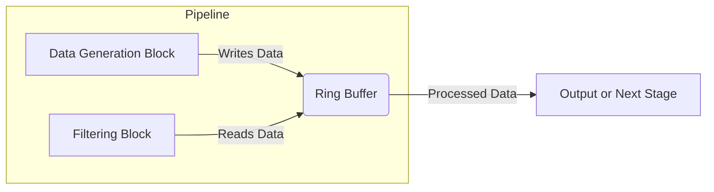

# Pipeline Architecture

## Overview
The system follows a **pipeline-based architecture** that consists of multiple processing blocks connected through a **ring buffer**. The pipeline runs indefinitely in a multithreaded fashion, continuously processing data.

---

## Architecture Diagram

---

## Components

### 1. **Pipeline**
- Manages the execution of the **Data Generation Block** and the **Filtering Block** in separate threads.

**Key Functions:**
- `start()`: Launches the data generation and filtering in separate threads.
- `stop()`: Terminates execution safely.
- `runDataGeneration()`: Calls the `execute()` method of the `DataGenerationBlock`.
- `runFiltering()`: Calls the `execute()` method of the `FilteringBlock`.

### 2. **Data Generation Block**
- Generates data and writes it into the **Ring Buffer**.
- Can either read data from a CSV file or generate random numbers.
- Processes **two numbers per execution** and immediately writes them to the buffer.

**Key Functions:**
- `execute()`: Reads two numbers and writes them to the ring buffer.
- `readCSV()`: Reads numbers from a CSV file.
- `generateRandomNumbers()`: Generates random numbers.

### 3. **Filtering Block**
- Reads data from the **Ring Buffer** and applies a **scalar-based filter**.
- Uses standard loops and arithmetic operations for filtering.

**Key Functions:**
- `execute()`: Reads a batch from the ring buffer, applies filtering, and stores results.
- `applyFilter()`: Uses **AVX intrinsics** to apply weights and threshold filtering.

### 4. **Ring Buffer**
- A circular buffer that allows efficient **multi-threaded** reading and writing.
- Prevents race conditions using synchronization mechanisms.

**Key Features:**
- Supports concurrent **reads** and **writes**.
- Uses **atomic variables** for thread safety.
- Prevents overwriting unread data using read/write pointers.

---

## Multithreading Considerations
- The **Data Generation Block** and **Filtering Block** execute in parallel.
- The **Ring Buffer** ensures synchronized communication between these blocks.

---

## Advantages of This Architecture
- **Scalability:** Additional processing blocks can be added easily.
- **Parallel Processing:** Data generation and filtering run simultaneously.
- **Flexibility:** The pipeline can be adapted for different types of processing.

